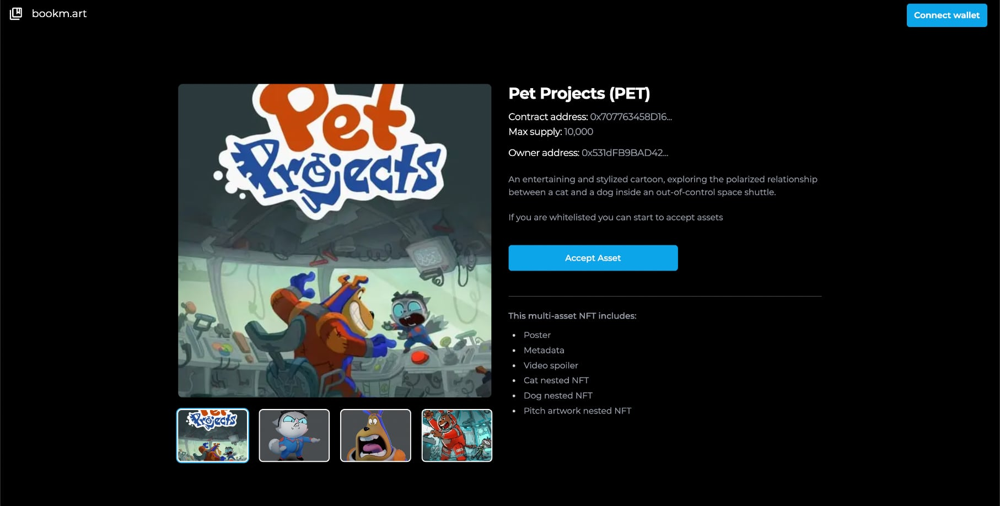

# BOOKM.ART SMART CONTRACTS

## Introduction

The most beautiful, powerful and intriguing objects have one thing in common: they live in galleries, libraries, archives, and museums (GLAM). All of them are institutions that collect and maintain cultural heritage materials in the public interest.

bookm.art is an open source platform powering the GLAM sector with richer digital experiences for their visitors on site and online using the NFT technology from [RMRK](https://www.rmrk.app) built on [zkSync Era](https://zksync.io).

bookm.art explores an innovative way of sharing stories and collections of content using the multi-asset and nested NFT smart contract implementations by the RMRK Team. From now the stories can be about a single object or a wider collection, but they always have a strong visual narrative by binding assets such as images, audio, video files and other NFTs.

Some of the benefits of nested and multi-assets NFTs for the GLAM sector are:

- Feature content collections, previews of exhibitions, or virtual tours.
- Promote perks and authenticity.
- Create a digital gift for someone you care about.
- Ensure more emotional, personal, and playful encounter with art.
- Create an improved NFT experience compared with ERC721 and ERC1125 alone.

Credit and kudos to RMRK Team.

## Set up instructions

1. Install packages with `yarn` or `npm i`
2. Check contract size: `yarn hardhat size-contracts`
3. Run prettier: `yarn prettier`
4. Copy .env.example into .env and set the variables
5. Use `contracts/`, `tests/` and `scripts/` to build your code.
6. Deploy on testnet: `yarn hardhat deploy-zksync --network zkSyncTestnet`

## Using Nestable and MultiAsset RMRK legos in bookm.art

bookm.art shows how the Nestable and MultiAsset RMRK legos are used to create a richer digital/NFT experience in galleries, libraries, archives, and museums.

## Use Case

The use case that bookm.art implements is a film/collection (exhibiton, catalog, etc...).

The film will be a collection of NFTs, each representing characters, extras,...

Each Film/Collection will be represented by an image, metadata, video and/or audio files.

And Each Character/Extra will be represented by an image and metadata.

The Film/Collection NFT will live in its own collection, while the Characters/Extras will live in their own collection.

## Smart Contracts

Here you will find the smart contracts for Film and Character.

    
Click to see the full code of the Film smart contract

        // SPDX-License-Identifier: Apache-2.0

        pragma solidity ^0.8.18;

        import "@rmrk-team/evm-contracts/contracts/RMRK/nestable/RMRKNestableMultiAsset.sol";
        import "@openzeppelin/contracts/access/Ownable.sol";

        error MintOverMaxSupply();
        error ZeroAddress();
        error ZeroAmount();

        contract Film is RMRKNestableMultiAsset, Ownable {
        uint256 public totalSupply;
        uint256 public maxSupply;
        uint64 public numberOfAssets;

            constructor(
                string memory name_,
                string memory symbol_,
                uint256 maxSupply_
            ) RMRKNestableMultiAsset(name_, symbol_) {
                maxSupply = maxSupply_;
            }

            function mint(address to, uint256 amount) public onlyOwner {
                if (amount == 0) revert ZeroAmount();
                if (to == address(0)) revert ZeroAddress();
                if (totalSupply + amount > maxSupply) revert MintOverMaxSupply();

                uint256 nextTokenId = totalSupply + 1;
                unchecked {
                    totalSupply += amount;
                }
                uint256 totalSupplyOffset = totalSupply + 1;

                for (uint256 i = nextTokenId; i < totalSupplyOffset; ) {
                    _safeMint(to, i, "");
                    unchecked {
                        i++;
                    }
                }
            }

            function AddAssetEntry(string memory metadataURI) public onlyOwner {
                unchecked {
                    numberOfAssets++;
                }
                _addAssetEntry(numberOfAssets, metadataURI);
            }

            function AddAssetToTokens(
                uint256[] memory tokenIds,
                uint64 assetId
            ) public onlyOwner {
                for (uint256 i = 0; i < tokenIds.length; ) {
                    _addAssetToToken(tokenIds[i], assetId, 0);

                    if (ownerOf(tokenIds[i]) == msg.sender) {
                        uint256 assetIndex = getPendingAssets(tokenIds[i]).length - 1;
                        acceptAsset(tokenIds[i], assetIndex, assetId);
                    }
                    unchecked {
                        i++;
                    }
                }
            }

        }

